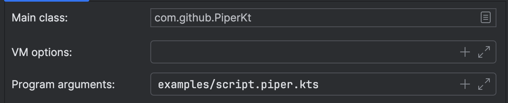

# Piper


*Keep in mind that this project is still only in a POC state*

Piper is an early-stage tool designed for building pipelines consisting of operators that execute user-defined scripts. While still in development, the tool aims to provide a structured approach for creating and managing pipelines.

The core concept is to enable the execution of any type of operator that, under the hood, utilizes a `Kubernetes resource`. These operators can be executed in a specific sequence defined by the user.

To simplify the pipeline creation process, Piper employs a Kotlin DSL (Domain-Specific Language). This DSL makes it easy for users to define pipelines intuitively and efficiently.

An example pipeline can be found in the `examples/script.piper.kts` file. This demonstrates how **Piper** facilitates the orchestration of multiple operators in a clean and user-friendly syntax. Piper strictly detects files with the `.piper.kts` extension and supports the use of dependencies from Piper’s core library.

For instance, you can declare and include a Python script (e.g., script.py) or scripts in other languages such as Bash or KScript.

Below is a brief demonstration to serve as documentation:

Declare for instance python script called `script.py` or any other language (eg. bash, kscript,...)

```python
print('[Python] Running operator 1...')
```


Declare the pipeline:

```kotlin

import com.github.piper.dsl.Dag
import com.github.piper.dsl.k8sParallelTask
import com.github.piper.dsl.k8sTask
import com.github.piper.dsl.pipe
//import com.github.piper.kubernetes.crd.register
import com.github.piper.primitives.time.Schedule.OneOffSchedule
import java.time.OffsetDateTime


// register() // should only run for the first time to register the CRDs

val dag = Dag("my_pipeline") {

    k8sTask("first") {
        image = "python"
        command = listOf("python")
        scriptPath = "src/test/resources/scripts/script1.py"
        resources {
            minMemory = 512.0
            maxMemory = 1024.0
            minCpuCores = 1.0
            maxCpuCores = 2.0
        }
    } pipe k8sParallelTask {

        branch {
            k8sTask("second") {
                image = "ubuntu:latest"
                command = listOf("/bin/sh")
                scriptPath = "src/test/resources/scripts/script2.sh"
                resources {
                    minMemory = 512.0
                    maxMemory = 1024.0
                    minCpuCores = 1.0
                    maxCpuCores = 2.0
                }
            } pipe k8sTask("third") {
                image = "ubuntu:latest"
                command = listOf("/bin/sh")
                scriptPath = "src/test/resources/scripts/script3.sh"
                resources {
                    minMemory = 512.0
                    maxMemory = 1024.0
                    minCpuCores = 1.0
                    maxCpuCores = 2.0
                }
            }
        }

        branch {
            k8sTask("fourth") {
                image = "ubuntu:latest"
                command = listOf("/bin/sh")
                scriptPath = "src/test/resources/scripts/script4.sh"
            }
        }

    } pipe k8sTask("fifth") {
        image = "ubuntu:latest"
        command = listOf("/bin/sh")
        scriptPath = "src/test/resources/scripts/script5.sh"
    }
}

dag
    .visualize()
    .activate()

```

Now since this script has already been defined here `examples/script.piper.kts` we can just run 
`host/src/main/kotlin/Piper.kt` with an argument on the filepath `examples/script.piper.kts`.



Once you run it, you should be able to see that the KubernetesJobOperators you've defined are running.
You can use a tool like `kubectl` or `k9s` to view the execution of each job/pod.

